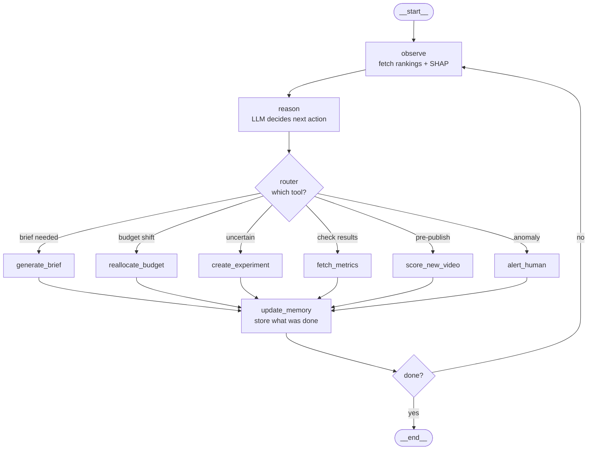

# 🤖 Agentic System

> Each day we rank the performance of our videos and fetch insights of the video.
> With the insights we invoke the agent.
> We create some tools like:
> - `create_brief`
> - `reallocate_budget`
> - `create_experiment`
> - `fetch_metrics`
> - `score_new_video`
> - `alert_human`
>
> We can also implement a human-in-the-loop architecture for major decisions.

---

## How It Works

Every day the agent runs a loop:

1. **Observe** — read latest video rankings + SHAP explanations
2. **Reason** — LLM  looks at the insights and decides what to do
3. **Act** — calls one of the tools above
4. **Remember** — stores what it did and what worked, feeds back into the model

---

## Agent Architecture

---

## Tools

| Tool | What it does |
|------|-------------|
| `generate_brief` | Reads SHAP insights and writes the next video creative brief |
| `reallocate_budget` | Increases spend on top-ranked ads, pauses bottom performers |
| `create_experiment` | Runs an A/B test when the agent is uncertain between two styles |
| `fetch_metrics` | Checks results of experiments and updates the model |
| `score_new_video` | Before a video goes live, predicts its performance score — catches bad creatives early |
| `alert_human` | Sends a Slack/email notification when something unusual happens (sudden CTR drop, viral spike) |

---

## Memory

| Type | What it stores |
|------|---------------|
| **Short-term** | Current rankings, active experiments, briefs from this week |
| **Long-term** | What has historically worked — feeds back into LightGBM retraining |

---

## Human-in-the-Loop

Not every action auto-executes. Major decisions (like large budget shifts) require human approval before the agent proceeds.
