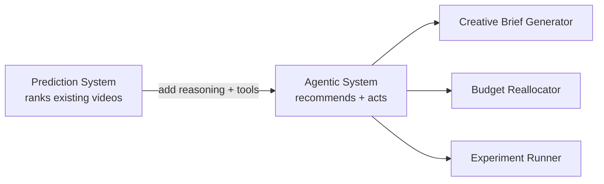
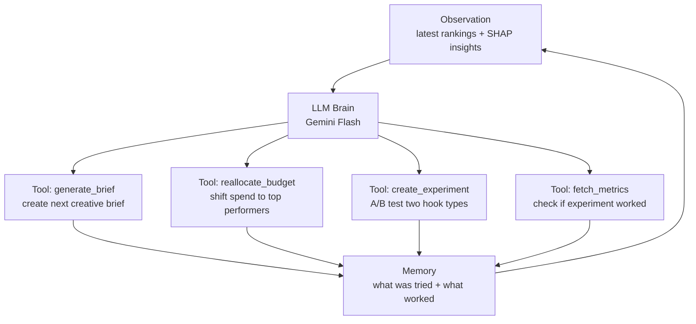

# 🤖 Evolving into an Agentic System

> Beyond prediction — a system that **acts**, not just ranks.

---

## The Shift: Predict → Recommend → Execute



The prediction system answers: *"which video will perform best?"*  
The agent answers: *"what should we do next — and then does it."*

---

## Agent Architecture



The agent runs in a loop: **Observe → Reason → Act → Learn → Repeat**

---

## What Each Tool Does

### 1. `generate_brief` — Creative Recommendation
After SHAP reveals that *story hooks + faces drive 70% of performance*, the agent writes the next brief automatically:

```
Agent output:
"For your next video:
 - Open with a 3-second story hook (person sharing a problem)
 - Show a face in the first frame
 - Use upbeat background music
 - Add a CTA at 8 seconds
 - Keep under 20 seconds"
```

No human needed to interpret the data — the agent reads SHAP values and drafts the brief.

### 2. `reallocate_budget` — Autonomous Spend Optimization
Agent connects to Meta Ads API and increases daily budget on top-ranked ads, pauses bottom performers:

```python
def reallocate_budget(rankings, total_budget):
    # Top 3 get 70% of budget, rest get paused
    for i, video in enumerate(rankings):
        if i < 3:
            set_ad_budget(video["ad_id"], total_budget * weights[i])
        else:
            pause_ad(video["ad_id"])
```

### 3. `create_experiment` — A/B Test Runner
Agent detects uncertainty (two hook types have similar SHAP values) and automatically creates an A/B test:

```
Agent: "I'm not sure if 'question hooks' beat 'story hooks' for your brand.
        I've created an experiment: running both for 48 hours, equal budget.
        I'll report back with the winner."
```

### 4. `fetch_metrics` — Close the Loop
Agent checks experiment results, updates the model, and incorporates learnings into future predictions — **getting smarter over time**.

---

## Agent Memory

The agent keeps two types of memory:

| Type | What it stores |
|------|---------------|
| **Short-term** | Current rankings, active experiments, this week's briefs |
| **Long-term** | What worked historically — "story hooks always win for this brand" |

Long-term memory feeds back into LightGBM training as additional signal.

---

## Human-in-the-Loop (for safety)

Not every action auto-executes. The agent uses a confidence threshold:

```
High confidence (>0.85) → auto-execute (budget reallocation)
Medium confidence (0.6–0.85) → suggest to human, wait for approval
Low confidence (<0.6) → flag for review, run experiment first
```

---

## One-Line Summary

> The prediction system tells you what worked. The agent figures out what to do next, does it, measures the result, and learns — closing the loop from data to action without manual intervention.
