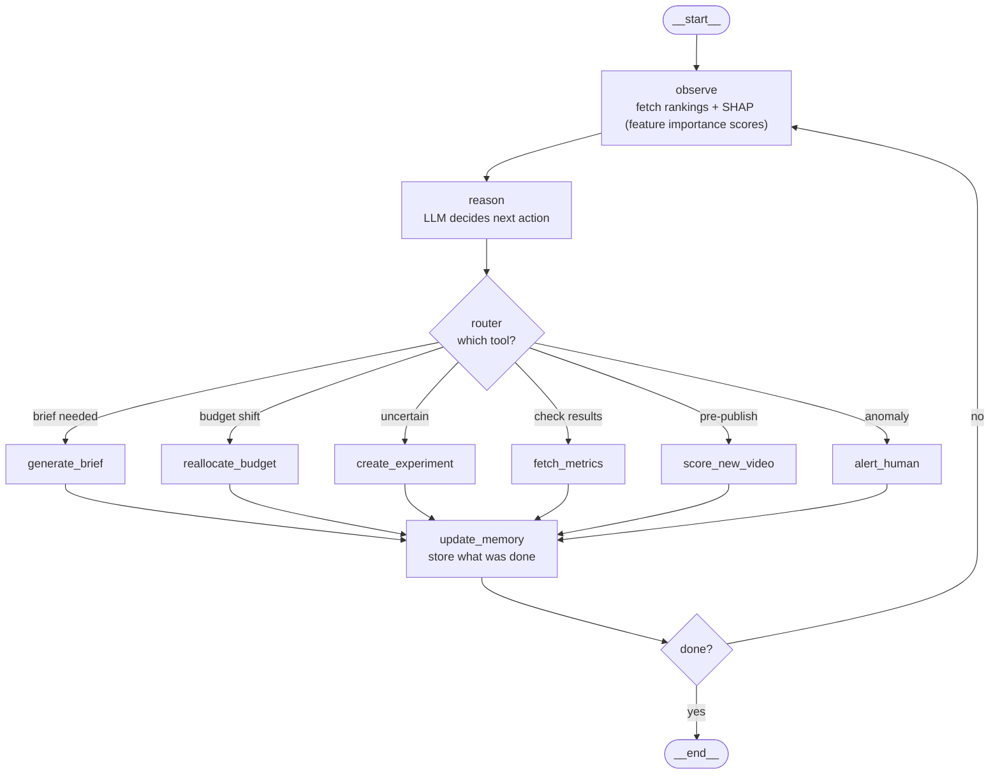

# 🤖 Agentic System

> The prediction system tells us **which videos performed best**.
> The agent goes further — it takes those insights and **acts on them automatically**.
>
> Each day we rank the performance of our videos and fetch SHAP insights.
> With those insights, we invoke the agent — it runs a loop of observe → reason → act → remember.
>
> We give the agent these tools:
> - `generate_brief` — write the next creative brief based on what worked
> - `reallocate_budget` — shift spend to top performers, pause the rest
> - `create_experiment` — run an A/B test when the agent is uncertain
> - `fetch_metrics` — check if an experiment worked, update the model
> - `score_new_video` — predict a video's score before it goes live
> - `alert_human` — notify the team when something unusual happens
>
> For major decisions, we implement a **human-in-the-loop** — the agent suggests, a human approves.

---

## Agent Architecture

---

## Tools

| Tool | What it does |
|------|-------------|
| `generate_brief` | Reads SHAP insights and writes the next video creative brief |
| `reallocate_budget` | Increases spend on top-ranked ads, pauses bottom performers |
| `create_experiment` | Runs an A/B test when the agent is uncertain between two styles |
| `fetch_metrics` | Checks results of experiments and updates the model |
| `score_new_video` | Before a video goes live, predicts its performance score — catches bad creatives early |
| `alert_human` | Sends a Slack/email notification when something unusual happens (sudden CTR drop, viral spike) |

---

## Memory

| Type | What it stores |
|------|---------------|
| **Short-term** | Current rankings, active experiments, briefs from this week |
| **Long-term** | What has historically worked — feeds back into LightGBM retraining |

---

## Human-in-the-Loop

Not every action auto-executes. Major decisions (like large budget shifts) require human approval before the agent proceeds.
