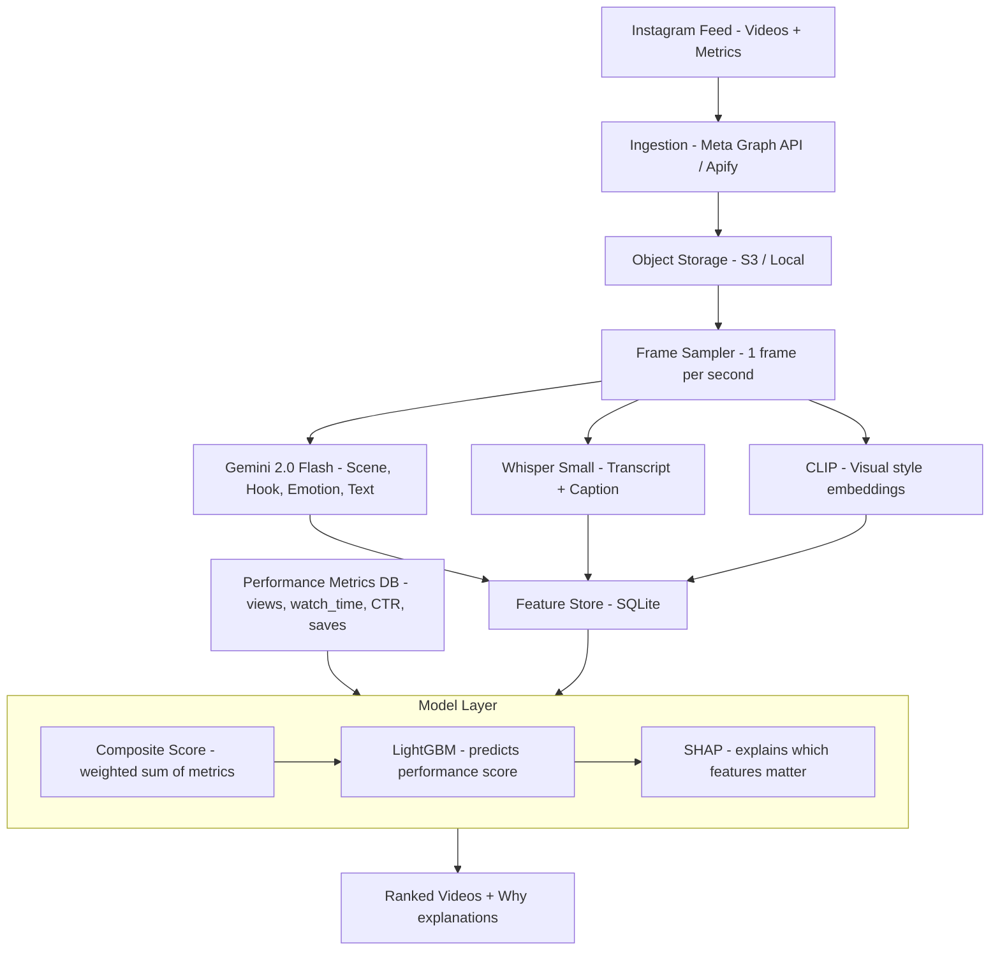

# 🦅 Hawky.ai — Video Understanding & Performance Prediction

> **Thesis:** We need to build a pipeline where:
>
> 1. Download the videos and metrics like views, shares, likes etc.
> 2. Divide the video into 1 frame per second — so a 20 second video gives 20 frames.
> 3. Use one vision model (like Gemini Flash Vision), one audio transcription model (like Whisper from OpenAI), and a vector embedding model (CLIP) to identify what each frame contains in vector space.
> 4. Build a ranking model using LightGBM — we use this because we have mixed data like scores (views, shares) along with vector embeddings.
> 5. Use SHAP to explain which creative features (hook type, face, music tempo) drove the ranking score for each video .

---

## System Architecture

---

## Models Used

| Role | Model | Provider | Est. Cost |
|------|-------|----------|-----------|
| Video understanding (scene, hook, emotion, text) | **Gemini 2.0 Flash** | OpenRouter | ~$0.003–0.008 / video |
| Audio transcription | **Whisper Small** | Replicate | ~$0.005 / video |
| Visual style embeddings | **CLIP ViT-L/14** | Replicate | ~$0.002 / video |
| Performance ranking | **LightGBM** | Local (no API) | Free |
| Explainability | **SHAP** | Local (no API) | Free |

> **Total API cost ≈ $1.00–2.00 per 100 videos**

---
